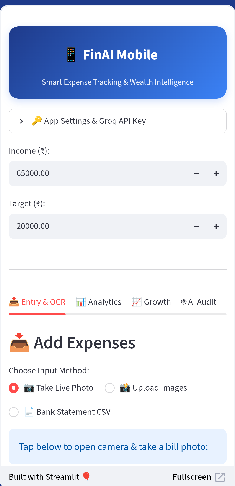
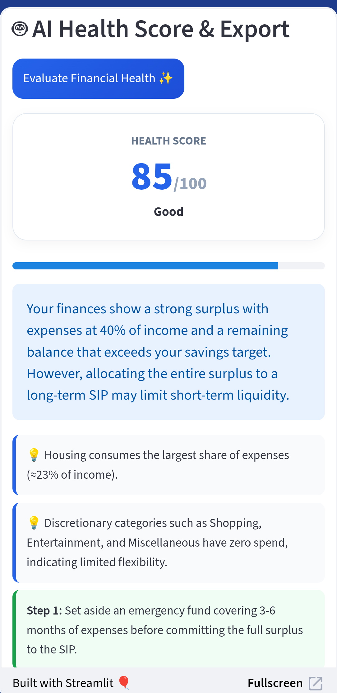

# 💰 Personal FinAI — AI-Powered Personal Finance Dashboard

An AI-powered personal finance application developed as part of the **Samsung Innovation Campus (SIC) Generative AI Capstone Project**.

Personal FinAI helps users analyze expenses, extract transaction information from receipts using Vision AI, automatically categorize transactions using Generative AI, visualize spending patterns, simulate SIP-based wealth growth, and generate an AI-powered financial health assessment.

---

## 📌 Project Overview

Managing personal finances often involves manually recording expenses, categorizing transactions, analyzing spending patterns, and planning savings.

**Personal FinAI** combines financial data analysis with Generative AI to simplify these tasks through a mobile-oriented Streamlit web application.

The application supports:

- 📷 AI-powered receipt scanning
- 📄 CSV bank statement analysis
- 🏷️ AI-powered transaction categorization
- 📊 Expense analytics and visualization
- 📈 SIP and wealth-growth simulation
- 🤖 AI-powered financial health assessment
- 💡 AI-generated spending observations and action plans
- 📑 Downloadable financial health reports

---

## ✨ Key Features

### 📷 1. AI Receipt Scanner

Users can:

- Capture a receipt using a device camera
- Upload one or more receipt images
- Process multiple receipts in parallel

Vision AI extracts structured information from receipts, including:

- Date
- Merchant / description
- Category
- Amount
- Tax amount
- Payment method
- Confidence level
- Summary of purchased items

---

### 📄 2. CSV Bank Statement Analysis

Users can upload a CSV transaction statement.

The application:

1. Reads the transaction data
2. Identifies transaction descriptions
3. Uses Generative AI to categorize transactions
4. Adds categories to the transaction dataset
5. Uses the categorized data for financial analytics

Supported categories include:

- Housing / Rent
- Groceries & Food
- Transportation
- Utilities & Bills
- Shopping
- Entertainment
- Miscellaneous / Other

---

### 📊 3. Financial Analytics

The dashboard calculates and displays:

- Total expenses
- Remaining balance
- Savings target status
- Expense category breakdown
- Income vs. expenses vs. savings target

Interactive visualizations are generated using Plotly.

---

### 📈 4. SIP & Wealth Simulator

The application provides a SIP-based wealth projection tool.

Users can configure:

- Monthly SIP amount
- Expected annual return
- Investment duration
- Annual SIP step-up percentage

The simulator estimates:

- Total amount invested
- Projected wealth
- Year-by-year wealth growth

> **Note:** SIP projections are educational estimates based on user-provided assumptions. They are not guaranteed investment returns or investment advice.

---

### 🤖 5. AI Financial Health Audit

The application uses Generative AI to analyze the user's financial information.

The analysis can consider:

- Income
- Savings target
- Total expenses
- Category-wise spending
- SIP amount
- Investment duration
- Expected return assumption

The AI generates:

- Financial health score out of 100
- Financial status
- Executive summary
- Spending observations
- Recommended action plan

---

### 📑 6. PDF Financial Health Report

Users can generate and download a structured financial report containing:

- Monthly income
- Total spending
- Savings ratio
- Expense-to-income ratio
- Savings target
- Remaining balance
- Expense category breakdown
- Transaction audit ledger
- AI financial health score
- AI-generated diagnostic summary

---

## 🧠 Generative AI Integration

Generative AI is integrated into multiple parts of the application.

| Feature | AI Usage |
|---|---|
| Receipt Scanner | Vision AI extracts structured receipt information |
| Transaction Categorization | LLM classifies transaction descriptions |
| Financial Health Audit | LLM analyzes financial information |
| Financial Recommendations | LLM generates observations and action steps |
| Structured Output | JSON responses are used for application processing |

The application uses the **Groq API** to access the configured language and vision models.

---

## 🏗️ Application Workflow

```text
                         ┌──────────────────┐
                         │       User       │
                         └────────┬─────────┘
                                  │
                   ┌──────────────┴──────────────┐
                   │                             │
                   ▼                             ▼
            Receipt Image                  CSV Statement
                   │                             │
                   ▼                             ▼
              Vision AI                  LLM Categorization
                   │                             │
                   └──────────────┬──────────────┘
                                  ▼
                       Transaction Information
                                  │
                                  ▼
                       Financial Data Analysis
                                  │
                 ┌────────────────┼────────────────┐
                 │                │                │
                 ▼                ▼                ▼
             Analytics      SIP Simulator     AI Health Audit
                 │                │                │
                 └────────────────┼────────────────┘
                                  ▼
                    Financial Health Assessment
                                  │
                                  ▼
                         PDF Report Export
```

---

## 📸 Application Screenshots

### 🏠 Dashboard



### 📥 Entry & OCR


### 📊 Financial Analytics


### 💵 Cash Flow Analysis


### 📈 SIP Wealth Simulator


### 🤖 AI Financial Health Audit



---

## 📱 Application Sections

### 1. 📥 Entry & OCR

- Live camera receipt capture
- Receipt image upload
- Parallel receipt processing
- CSV statement upload
- AI transaction categorization

### 2. 📊 Analytics

- Expense summary
- Net balance
- Savings target status
- Category-wise expense visualization
- Cash-flow comparison

### 3. 📈 Growth

- SIP calculator
- Expected return configuration
- Investment duration
- Annual step-up
- Projected wealth visualization

### 4. 🤖 AI Audit

- Financial health score
- AI-generated summary
- Spending observations
- Action plan
- PDF report generation

---

## 🛠️ Technology Stack

### Programming & Application

- **Python**
- **Streamlit**

### Generative AI

- **Groq API**
- LLM-based transaction categorization
- Vision AI-based receipt extraction
- Structured JSON AI responses

### Data Processing

- **Pandas**
- CSV processing
- Transaction aggregation
- Expense categorization

### Visualization

- **Plotly**
- Interactive financial charts
- Expense breakdown visualization
- Wealth-growth visualization

### Image Processing

- **Pillow**
- Receipt image resizing
- Image compression

### Report Generation

- **ReportLab**
- Automated PDF financial reports

---

## 📂 Project Structure

```text
finai-mobile-app/
│
├── .devcontainer/
│
├── screenshots/
│   ├── 1-dashboard.png
│   ├── 2-entry-ocr.png
│   ├── 3-analytics-overview.png
│   ├── 4-cash-flow.png
│   ├── 5-sip-simulator.png
│   └── 6-ai-audit.png
│
├── app.py
│   └── Main Streamlit application
│
├── requirements.txt
│   └── Python dependencies
│
└── README.md
    └── Project documentation
```

---

## 🚀 Getting Started

### Prerequisites

- Python 3.x
- Git
- A Groq API key

### 1. Clone the repository

```bash
git clone https://github.com/IoTSec-AI/finai-mobile-app.git
cd finai-mobile-app
```

### 2. Create a virtual environment

#### Windows

```bash
python -m venv venv
venv\Scripts\activate
```

#### Linux / macOS

```bash
python3 -m venv venv
source venv/bin/activate
```

### 3. Install dependencies

```bash
pip install -r requirements.txt
```

### 4. Run the application

```bash
streamlit run app.py
```

### 5. Enter the Groq API key

After opening the application, enter your Groq API key in:

**App Settings → Groq API Key**

The application uses the key at runtime for AI-powered functionality.

---

## 🔐 Security & API Key Handling

The application does not require a Groq API key to be hard-coded into the source code.

The API key is entered at runtime through a password-type input field and passed to the Groq client when AI functionality is used.

**Never commit API keys, passwords, tokens, or other credentials to the repository.**

---

## 🎓 Samsung Innovation Campus Capstone

This project was developed as part of the **Samsung Innovation Campus (SIC) Generative AI program**.

The project demonstrates the practical application of Generative AI to a real-world personal finance use case by combining:

- Generative AI
- Vision AI
- Python
- Data processing
- Interactive dashboards
- Financial analytics
- Automated reporting

The project focuses on transforming raw financial information into structured data, visual insights, and AI-generated financial observations.

---

## 🔮 Future Improvements

Potential future improvements include:

- Persistent transaction storage
- Database-backed user transaction history
- User authentication and authorization
- Improved receipt validation
- Budget alerts and notifications
- Personalized financial goals
- Advanced financial trend analysis
- More detailed AI insights
- Secure server-side API key management
- Enhanced financial reports
- Production-grade deployment

---

## ⚠️ Disclaimer

Personal FinAI is an educational and demonstration project.

Financial health scores, AI-generated recommendations, SIP projections, and financial calculations are intended for informational purposes only and should **not be considered professional financial, investment, tax, or legal advice**.

Investment projections are based on user-provided assumptions and are not guaranteed returns.

---

## 👨‍💻 Project Information

**Project:** Personal FinAI — AI-Powered Personal Finance Dashboard

**Program:** Samsung Innovation Campus — Generative AI Capstone Project

**Repository:**  
https://github.com/IoTSec-AI/finai-mobile-app
